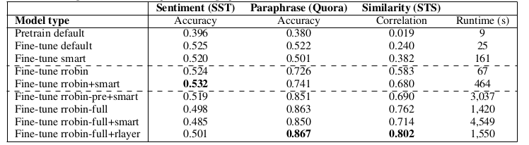

## 单任务

单任务（sst）预训练/微调命令：

```
python3 classifier.py --option pretrain --epochs=10 --lr=1e-3 --batch_size=64 --use_gpu
python3 classifier.py --option finetune --epochs=5 --lr=1e-5 --batch_size=32 --use_gpu
```

pretrain：
- SST dev acc = 0.423
- CFIMDB dev acc = 0.841

finetune:
- SST dev acc = 0.510
- CFIMDB dev acc = 0.963

有一个很有意思的问题：pretrain模式下`param.requires_grad = False`，那为什么pretrain下每个epoch的dev acc还会有提升？

## 多任务
多任务预训练/微调命令：
```
python3 multitask_classifier.py --option pretrain --epochs=10 --lr=1e-3 --batch_size=64 --use_gpu
python3 multitask_classifier.py --option finetune --epochs=10 --lr=1e-5 --batch_size=64 --use_gpu
```
仅测试不训练则添加`--test`参数：
```
python3 multitask_classifier.py --option finetune --epochs=10 --lr=1e-5 --batch_size=64 --use_gpu --test
```
- sst train set size = 8545
- para train set size = 141507
- sts train set size = 6041

预训练结果：
- dev sentiment acc : 0.411
- dev paraphrase acc : 0.375
- dev sts corr : 0.260
- average performance: 0.349

微调结果 (10 epochs)：
- dev sentiment acc : 0.480
- dev paraphrase acc : 0.375
- dev sts corr : 0.405
- average performance: 0.420

## 参考结果

report：Walk Less and Only Down Smooth Valleys

前三列是用三种方法在三个数据集上单独学习的，中间两列是小规模数据集（每个数据集等batch-size）上的带有/不带有smart正则化算法的轮询，后三列是在完整数据集上的结果，使用预训练（pre）、不同batch-size（rrobin-full）、paraphrase和STS的共享层（rlayer）、smart正则化



结果可以说明，在小规模数据集上无smart正则化（fine-tune rrobin）会更容易形成过拟合。
