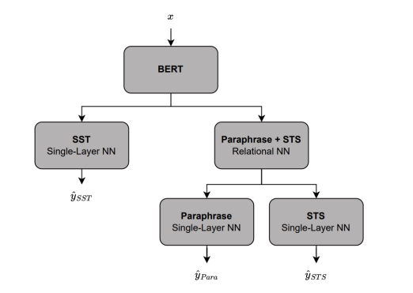

在Walk Less and Only Down Smooth Valleys这篇report中提到的文章与方法：
- Improving multi-task deep neural networks via knowledge和Multi-Task Deep Neural Networks for Natural Language Understanding 
  
  提出additional pre-training和uneven batching strategies的方法。在Improving multi-task deep neural networks via knowledge distillation for natural language understanding还提出了"shared multitask learning"的方法，通过在预训练权重的顶部添加一个神经网络层来连接并捕捉相似任务之间的相关性。
  
- SMART：用来正则化的方法，减少过拟合。过限制输入的小扰动范围（在p-欧几里得度量下），可以鼓励模型在输入的邻域内保持平滑，从而提高其在低资源环境中的表现和泛化能力。于是数据少也不会过拟合。
  
  但是SMART与dropout是冲突的，所以report最后为了SMART没用dropout
  
  并且数据多的情况下也不需要正则化，因为不太会过拟合。这也是为什么table 2中Fine-tune rrobin-full+smart不如Fine-tune rrobin-full
  
- Sentence-bert：对于paraphrase任务使用[CLS] embedding $h_u, h_v$和它们的距离$\|h_u - h_v\|$作为NN的输入，输出相似度；使用binary cross-entropy作为损失函数

- 对于STS任务计算两个句子的cosine similarity作为输入，输出相似度；使用mean-squared error作为损失函数

- MTL：Multi-task learning

- 训练方法：

  - How to fine-tune BERT for text classification?：additional Quora pretraining

    指出可以拿相比之下很大的Quora数据集来热热身，然后等batch-size的在三个数据集上训练。但这样会让bert在Quora上忘记generalizable embeddings，沦为只会做paraphrase的东西

  - Improving multi-task deep neural networks via knowledge distillation for natural language understanding：interleaved fine-tuning

    指出小数据集就用小batch-size，大数据集就用大batch-size。这篇文章还提出了共享层，也就是说paraphrase和STS都是输入两个句子的embedding，输出a single hidden layer embedding。用了带有LeakyReLU共享层就不能对STS用余弦相似度了（什么是余弦相似度？TODO），于是引入scaled Hadamard product

    共享层（shared layer/relational layer）的具体使用过程：

    1. 句子经过BERT得到$h_u, h_v$
    2. 计算得Scaled Hadamard Product，这得到一个新的hidden layer embedding
    3. 把这个hidden layer embedding传入共享层，在共享层中，这个特征向量会经过一系列的处理，例如非线性变换（如LeakyReLU激活函数），以及可能的其他网络结构。
    4. 把共享层的结果丢给下游的NN，输出paraphrase和STS的预测结果

    

- An algorithm for routing vectors in sequences：得到SST acc最高值59%

